# 使用文档

## 项目介绍

接口自动化测试项目2.0

### 软件架构

本框架主要是基于 Python + unittest + ddt + HTMLTestRunner + log + excel + mysql + 企业微信通知 + Jenkins 实现的接口自动化框架。

* 项目参与者: 陈勇志
* 技术支持邮箱: 262667641@qq.com
* 个人微信: Testing_Player
* 个人博客地址:  [https://home.cnblogs.com/u/Nephalem-262667641](https://home.cnblogs.com/u/Nephalem-262667641)
* 微信公众号：测试玩家勇哥

### 前言

公司突然要求你做自动化，但是没有代码基础不知道怎么做？或者有自动化基础，但是不知道如何系统性的做自动化，
放在 excel 文件中维护，不知道如何处理多业务依赖的逻辑，又或者你想想postman一样可以给每一条测试用例编写一些代码来处理脚本，但是又不知道怎么做。
那么 gitee 中勇哥的自动化测试框架，将为你解决这些问题。

### 框架优势

本框架不收取汾河费用，其优势在于测试人员直接编写测试用例，运行一个测试文件就可以自动执行所有测试用例。

框架主要使用 python 语言编写，结合 unittest 进行二次开发，用户仅需要在 excel 文件中编写测试用例，
编写成功之后，会自动生成测试用例的代码，零基础代码小白，也可以操作。

本框架支持多环境切换，多业务接口依赖，mysql 数据库断言和 接口响应断言，并且用例直接在 excel 文件中维护，无需编写业务代码，
本框架支持动态脚本函数扩展，可以随时内部预置函数，或者增加动态脚本，通过固定格式写法 {{fun()}} 动态调用
接口 unittest 框架生成 HTML 报告及 excel 用例执行报告，并且发送 企业微信通知/ 钉钉通知/ 邮箱通知/ 飞书通知，灵活配置。

### 实现功能

* 测试数据隔离, 实现数据驱动。
* 支持多套环境使用，比如测试用例相同，但是环境不同，只需在 excel 中启用需要执行的环境即可。
* 支持多接口数据依赖: 如A接口需要同时依赖 B、C 接口的响应数据作为参数,或者 c 接口断言需要动态使用A接口的入参作为预期结果。
* 数据库断言: 直接在测试用例中写入查询的 sql 即可断言，无需编写代码。
* 动态多断言: 如接口需要同时校验响应数据和 sql 校验，支持多场景断言。
* 支持自定义脚本代码（python语言），可以让你像 postman 一样给每一条测试用例编写任意前后置脚本代码，内置了 action
  对象操作及一些方法可以很便捷的处理前置或后置脚本。
* 自动生成用例代码: 测试人员在 excel 文件中填写好测试用例, 程序可以直接生成用例代码，纯小白也能使用。
* 支持自定义拓展函数: 如用例中需要使用自己实现的函数，可以随时在指定的目录下面写上函数，通过 {{func(*args,**kwargs)}}
  随时调用你自己设置的函数。
* 内置实现了一部分随意函数及自定义常用函数：如:随机字符串、任意日期时间、随机gps、随机用户身份证、地址、邮箱、企业信息等等，用户还可以自己定义任意函数，无门槛使用。
* 统计接口的运行时长: 拓展功能，订制开关，可以决定是否需要使用。
* 支持用例定时器运行，比如：B用例执行前需要A用例执行后等待5秒才开始执行，可以随意加上等待时间。
* 日志模块: 打印每个接口的日志信息，同样订制了开关，可以决定是否需要打印日志。
* 钉钉、企业微信通知、邮件通知: 支持多种通知场景，执行成功之后，可选择发送钉钉、或者企业微信、邮箱通知。
* 封装了发送MQTT的类，支持发送MQTT消息。
* 支持导入postman或者swargs导出的json文件自动处理成测试用例，然后修改一下参数即可使用。

### gitee 地址

接口自动化框架地址：[点我查看](https://gitee.com/chenyongzhiaaron_admin/apitest/edit/master/README.md)

### 遇到问题

* 请仔细阅读文档，文档中几乎可以帮你避免所有的问题
* 可以添加微信： blue-blue-lemon, 添加微信会将你拉倒自动化交流群中，群内有很多热心的小伙伴，但是前提是希望你已经阅读了文档中的所有内容
* 你也可以请作者为你解答，当然在我时间空闲的时候，也可以让作者为你一对一服务，当然是收费的。

### 目录结构

```markdown
.
└── cases/ // 测试用例数据文件夹
    └── cases/ // 测试用例
        └── test_cases.xlsx
    └── templates/ // 测试用例模板
        └── template.xlsx
    └── temporary_file/ // swagger| postman 导出的 json文件存放位置
        └── openapi.json
        └── postman.json
└── common/ // 配置及核心功能代码
    └── bif_functions/ // 内置函数工具
        └── __init__.py
        └── bif_datetime.py // 内置日期时间函数
        └── bif_hashlib.py // 内置hash 函数
        └── bif_json.py // 内置json解析函数
        └── bif_list.py // 内置列表操作函数
        └── bif_random.py // 内置随机函数
        └── bif_re.py // 内置正则函数
        └── bif_str.py // 内置字符串函数
        └── bif_time.py // 内置时间函数
        └── random_tools.py // 内置其他随机函数
    └── crypto/ // 加密工具
        └── __init__.py
        └── encrypt_data.py // 执行数据加密封装入口
        └── encryption_aes.py // aes 加密
        └── encryption_base64_to_image.py // base64 转图片工具
        └── encryption_main.py // 执行加入函数入口，对应excel中的加密方法选项，结合 extensions 中的 sign 可自定义加密规则
        └── encryption_rsa.py // rsa 加密
        └── encryption_str.py // 常用的字符串加密工具函数
    └── data_extraction/ // 数据提取器
        └── __init__.py
        └── analysis_json.py // json 字典分析函数，类似 jsonpath
        └── assert_dict.py // 旧断言字段函数 （暂时舍弃）
        └── data_extractor.py // 数据提取函数
        └── dependent_parameter.py // 数据替换函数
        └── dict_get.py // 旧路径提取函数
    └── database/ // 数据库操作工具
        └── __init__.py
        └── execute_sql_files.py // sql 批处理工具
        └── mongodb_client.py // mongoDB 操作工具
        └── mysql_client.py // mysql 操作工具
        └── psycopg_client.py // presto 操作工具      
        └── redis_client.py // redis 操作工具
    └── file_handling/ // 文件操作
        └── __init__.py
        └── do_excel.py // excel 处理
        └── excel.py // excel 处理
        └── file_utils.py // json、yarm等文件操作以及一些目录操作
    └── http_client/ // http_client 发送http的工具
        └── __init__.py
        └── http_client.py // http 请求封装
    └── MQclient/ // MQ 工具
        └── __init__.py
        └── mqtt_client.py // mqtt 工具
        └── rabbit_mq_client.py // rmq 工具
    └── random_tools/ // 常用随机数工具包
        └── credit_cards/ // 随机银行卡
            └── __init__.py
            └── bankcard.py
            └── cardbin.csv
        └── credit_identifiers/ // 随机企业唯一信用代码
            └── __init__.py
            └── address.json
            └── credit_identifier.py
            └── unified_social_credit_identifier.py
        └── emails/ // 随机邮箱
            └── __init__.py
            └── email.py
            └── free_email.csv
        └── identification/ // 随机身份证
            └── __init__.py
            └── area.csv
            └── id_card.py
        └── names/ // 随机姓名
            └── __init__.py
            └── first_name_boy.csv
            └── first_name_girl.csv
            └── last_name.csv
            └── name.py
        └── phone_numbers/ // 随机手机号
            └── __init__.py
            └── phone.py
            └── phone_area.csv
            └── __init__.py
    └── utils/ // 工具包
        └── __init__.py
        └── captcha.py // 识别图片转字符串，常用于验证码登录
        └── load_and_execute_script.py // 动态加载自定义python文件工具
        └── logger.py // loggin 日志封装
        └── mylogger.py // loguru 日志封装
        └── parsing_openapi.py // 解析 swagger 文件 转测试用例
        └── parsing_postman.py // 解析 postman 文件 转测试用例
        └── singleton.py // 单例
        └── WxworkSms.py // 企业微信
    └── validation/ // 断言及加载动条函数工具包
        └── __init__.py
        └── comparator_dict.py // 自定义比较器名词释义
        └── comparators.py // 自定义比较器
        └── extractor.py // 提取器
        └── load_modules_from_folder.py // 动态从模块中加载函数
        └── loaders.py // 动态加载函数及加载内置比较器等工具包
    └── validator.py // 断言校验器
        └── __init__.py
    └── action.py // 核心类
    └── config.py // 配置文件
    └── variables.py // 数据操作类
└── extensions/ // 动态扩展模块目录
    └── __init__.py
    └── ext_method_online.py // 动态扩展方法模块
    └── sign.py // 加签模块
└── image/
    └── wx.jpg
    └── zfb.jpg
└── OutPut/ // 日志报错
    └── log/
        └── 2023-06-25.log
        └── 2023-07-04.log
        └── 2023-07-05.log
    └── reports/
        └── history.json
└── scripts/ // 动态脚本目录
    └── __init__.py
        └── prepost_script_安全纯净大屏_2.py // 对应每条测试用例的前后置脚本（可选）
        └── request_script_sheetname_id.py
└── test_script/ // 测试脚本核心模块
    └── __init__.py
    └── test_api.py
└── directory_tree.txt                      
└── excel_converter.py // postman、swagger 文件转换主入口模块
└── generate_tree.py // 项目目录树模块
└── main_personal_information.py // 随机个人信息核心入口
└── pipenv_command.text             
└── Pipfile     
└── Pipfile.lock    
└── README.md
└── run.py // 自动化测试执行入口模块

```

### 安装教程

#### 依赖库

参考 pipenv --Pipfile 虚拟环境文件，不一一列出

首先，执行本框架之后，需要搭建好 python 环境，python 环境搭建自行百度

1. 安装 pipenv环境： pip install pipenv
2. 创建虚拟环境： pipenv install
3. 如果有个别包无法安装,则：pipenv shell 进入环境后，再pipenv install XX包

#### 使用说明

1. 测试用例只需要在 cases/cases/xxx.xlsx 文件填写测试用例即可，可以参考测试用例模板文件，由于模板文件的用例已经做了敏感信息处理，所以执行执行模板的用例应该会报错
2. 运行用例可以直接进入到 test_script/test_xxx.py 中，执行test_xxx.py文件，也可以直接运训 最外层的 run.py文件，
3. Personalinformation.py 这个文件是用来生成一些测试数据，方便做功能测试或者其他一般性测试使用

### 开放测试接口文档

大家可以使用开源接口中的登录、个人信息、收藏（新增、查看、修改、删除）等功能，编写接口自动化案例，然后测试程序脚本
下方是接口文档地址，大家可以自行查看（因为开源的接口，里面有些逻辑性的功能，如修改被删除的网址接口并没有过多的做判断，
因此用例中只写了一些基础的场景，仅供大家参考。）

- [https://wanandroid.com/blog/show/2](https://wanandroid.com/blog/show/2)

### 如何创建用例

#### excel中的测试用例相关字段介绍

下面是一个关于一个用例中的所有字段，字段不是全部必填
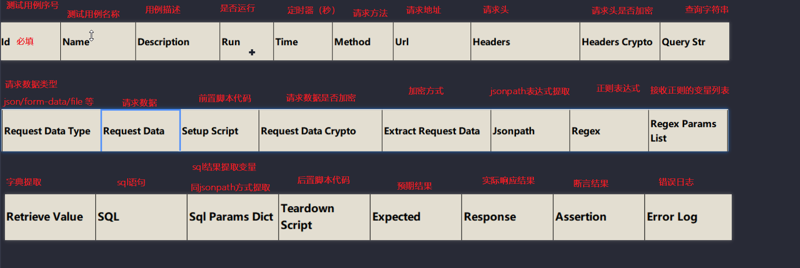
下面对每一个字段的作用，做出解释：

* Id：测试用例的id，唯一，必填
* Name: 测试用例的名称，必填
* Description: 测试用例描述，可选,建议填写，生成的报告会用到这个字段
* Run: 是否运行这条用例，如果不填或填写的不是`YES/yes`，则不运行这条用例
* Time: 定时器，数字，非必填，填写则会等待多少秒后运行这条用例
* Method： 请求方法，支持所有的http请求方法，`get/post/put/patch` 等等
* Url: 接口路径或者整个请求地址，如果不带域名，则会自动去init表中拼接host上去，Url中可以参数化，如：
  `/test/api/get/{{id}}/{{func(*args,**kwargs)}}`
* Headers: 请求头,字典填写方式，如：`{"Content-Type":"application/json","token":"{{token}}",'time':'{{timestamp()}}'}`
* Headers Crypto: 请求头是否加密，可以自定义加密方式，然后这里输入你的加密方法名即可,如 `MD5\sha1` 等
* Query Str: 查询字符串参数，也就是URL过长的时候，可以将URL后面的参数拆出来填写在这里，字典的方式填写，支持参数化
* Request Data Type: 请求参数类型，有 `json,file,params,data` 等等这几种
* Request Data： 请求参数，字典形式填写，支持参数化，如：`{"projectId":"{{projectId}}","tvSequence":"{{random_string()}}"}`
* Setup Script: 前置脚本，可以直接写 pthon 代码，比如类，函数，等等，如果是函数，类一定要调用才会执行。编写方式示例：

```python
# 可以写类，可以写函数，可以直接普通python语句，
def setup(action):
  print("获取action示例的属性", action.get_variables())
  # 更新属性到action实例的属性中
  action.update_variables("999", "99999")
  print("获取所有的临时变量", action.get_environments())
  print("将变量存到临时变量表中以便后续用例{{key}}使用", action.update_environments("key", "value"))
  print("将函数存到临时变量表，以便后面调用{{setup_func()}}也可以", action.update_environments("setup_func", setup))


# 调用方法
setup(action)
```

* Request Data Crypto： 请求参数是否加密，可以填写你需要的加密方式，如 `MD5\sha1` 等
* Extract Request Data：提取请求参数的字段或整个请求参数字典，如：`{"k": "$.projectId", "x": "$.data[0].age[3].a"}`
* Jsonpath: 提取响应结果的 jsonpath 表达式，示例：默认情况下若表达式结果只有一个值那么就存为字符串，如果表达式执行结果有多个值，那么就存为列表，表达式填写方式如下：
  `{"k": "$.data", "x": "$.data[0].age[3].a"}`
* Regex: 正则表达式，填写正则表达式字符串，示例： `r'"id": (\d+), "name": "(\w+)",'`
* Regex Params List：填写一个列表(list)，用来存正则表达式提取值的变量列表，如： `["a", "b"]`，则表示用a,b 变量接收上面的正则表达式的返回值
* Retrieve Value：python字典的取值方式，多条用分号间隔，如：`name=data[0].name;ok=data[0].id;an=data[0].age[3].a`
* SQL：填写增删改查sql语句,字典的key是需要执行的sql方法，值是sql语句，可以填写多条，填写格式示例：

```json
{
  "insert": {
    "insert_data": "INSERT INTO users (name, age, email) VALUES ('John', 25, 'john@example.com');"
  },
  "select": {
    "select_data": "SELECT name, age, email FROM users WHERE age > 20;"
  },
  "delete": {
    "delete_data": "DELETE FROM users WHERE age > 30;"
  },
  "update": {
    "update_data": "UPDATE users SET age = 26 WHERE name = 'John';"
  }
}
```

* Sql Params Dict：提取sql的结果，同jsonpath，如：`{"name": "$.select.select_data.name", "age": "$.select.select_data.age"}`
* Teardown Script: 后置python脚本代码，任意函数或者类，用例发送请求后会自动执行该代码
* Expected：预期结果，写法示例：`[{"check":"result.user.name","comparator":"eq","expect":"chenyongzhi"}]`
  or `{"check":"result.user.name","comparator":"eq","expect":"chenyongzhi"}`,支持的断言比较方式有如下这些：

```json
{
  "eq": "eq:实际值与期望值相等",
  "lt": "lt:实际值小于期望值",
  "lte": "lte:实际值小于或等于期望值",
  "gt": "gt:实际值大于期望值",
  "gte": "gte:实际值大于或等于期望值",
  "neq": "neq:实际值与期望值不相等",
  "str_eq": "str_eq:字符串实际值与期望值相同",
  "length_eq": "length_eq:实际值的长度等于期望长度",
  "length_gt": "length_gt:实际值的长度大于期望长度",
  "length_gte": "length_gte:实际值的长度大于或等于期望长度",
  "length_lt": "length_lt:实际值的长度小于期望长度",
  "length_lte": "length_lte:实际值的长度小于或等于期望长度",
  "contains": "contains:期望值包含在实际值中",
  "contained_by": "contained_by:实际值被包含在期望值中",
  "type_match": "type_match:实际值的类型与期望值的类型相匹配",
  "regex_match": "type_match:正则匹配(从字符串的起始位置匹配)",
  "regex_search": "regex_search:正则匹配(从字符串的任意位置匹配)",
  "startswith": "startswith:实际值是以期望值开始",
  "endswith": "endswith:实际值是以期望值结束"
}
```

* Response: 响应结果，用例执行后，会自动将结果回写到这个excel中，查看测试结果，一目了然。

#### 创建用例步骤

开始填写测试用例前，先看看这个init表的字段，下面我会统一讲解：
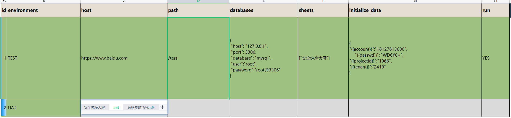

1. 在 `cases` 文件夹下方创建被测模块或者系统，然后在系统下创建相关的 `excel` 用例(可以复制模板excel文件来填写测试用例)
2. 将测试用例路径添加到 `common` 文件夹下的 `config.py` 文件中
3. 进入 `test_script/` 文件夹，在该文件夹下操作 `test_api.py` 文件将 `test_file` 变量地址替换为刚刚填写的测试用例地址
4. excel 中的用例必须填写用例 `id`,另外 `init sheet` 表照中的全局初始化数据字段 中的部分字段必须填写如：

```python
"""
# init 表中的字段
id: 序号
environment: 被测环境，建议填写：如测试环境，开发环境，生产环境等等
host：域名地址，如：https://www.baidu.com，非必填，填写了就会取这部分的地址与测试用例中的Url拼接发送请求 
path：一小部分的请求路径，比如所有的接口可能都存在:/test/api 这种，就可以填写上去，非必填
databases： 数据库，非必填，{"host": "127.0.0.1","port": 3306,"database": "mysql","user":"root","password":"root@3306"}
sheets：你想执行的sheet是哪一个，全部执行就填写 'all',部分执行就填写具体的sheet如["第一个sheet的名称","第二个sheet的名称"...]
initialize_data:初始化的一些固定参数，比如登录账号，密码，等等都是基本不变的数据可以填写这里，属于全局变量，填写方式字典{"{{username}}":"1234","{{pwd}}":"密码"}
run: 决定使用的环境，值为yes表示用这个环境运行，有多个环境都填写yes，只运行第一个yes
"""
```

以上都填写完成，记得先关闭 `excel`,然后就可以单独执行 `test_api.py` 文件，或者直接运行 `run.py`主入口文件，生成HTML报告及excel测试报告

### 下面我们来看一下，如何创建用例

#### 用例中相关字段的介绍

- 下发截图为 init 初始化基础数据填写用例
  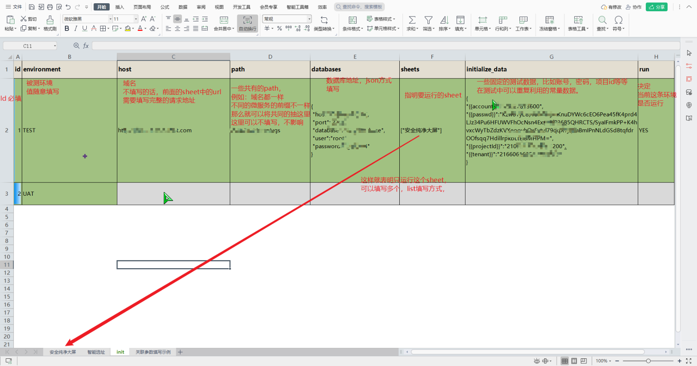
- init 中 sheets 内的列表排序是有作用的，执行用例是按照列表内值排序执行的。
- 下方截图就是 excel 用例 每个字段是否必填的描述
  
- 每条测试用例都可以自定义是否开启，开启则执行，不开启则跳过，默认执行结果是通过
- 每一个sheet都可以随意组合用例，不同sheet之间的变量参数可以共用（即变量全局的），不独立设计，主要是考虑到分sheet只是为了方面管理用例，但是执行依然是一次性全部执行
- 目前没有设计每一个sheet的最大用例条数，默认取excel最大数据量，如果发现最大数据量撑爆内存，建议分多个excel来写测试用例
- 目前使用的生成器的方式读取excel，主要是防止一次性内存被撑爆
- 测试报告是按照excel来生成的，测试报告的样式没有按模块区分，实际上直接打开excel就可以看到报告结果了。
- 其他一些没有多大作用的，通过率，跳过条数，通过条数，失败条数等，没有另外处理，全部由html的报告自动处理
- 下方截图为关联参数填写示例
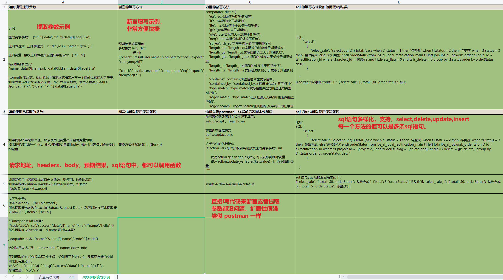


#### 常用的一些内置函数

所有的内置函数都在 `common/bif_functions` 这个包内，用户可以自定义添加内置函数，设计内置函数一定要设计返回值，不能直接返回
None，貌似没有对 None 特殊处理
以下是一些内置函数讲解


- 这个MD5方法，一般都没有使用，一般都是直接excel中是否使用【参数加密方式字段开关】来处理加密
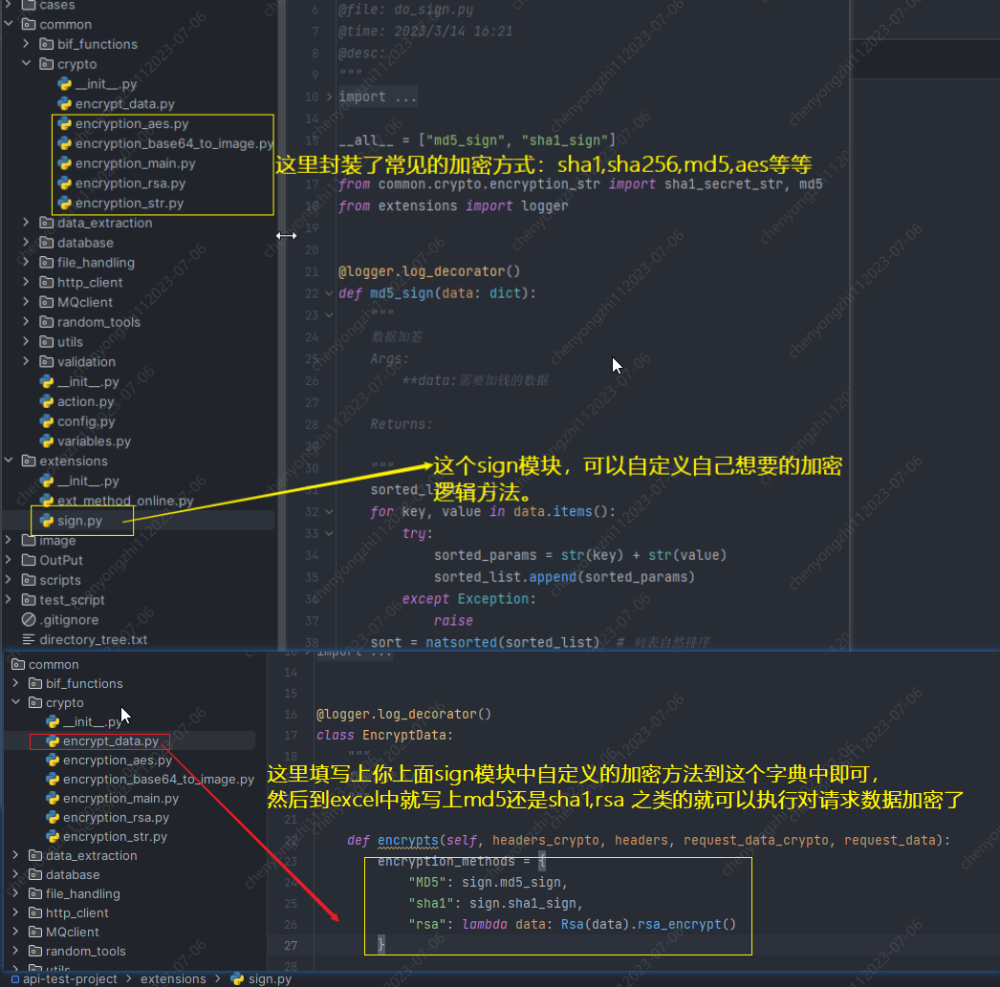
  
- 内置函数使用，统一是 `{{xxx()}}`，可以传参数到()内,比如 `{{token(999)}}`
  
- 获取一些时间戳方法，可以带参数
  
- Faker 库里面的有些随机数，需要更多自己添加就行了。

#### 用例中添加等待时间

excel 字段中一个 `Time`，字段值设置为 `数字`，单位S


#### 用例在执行前，需要单独执行 sql 或者执行后需要单独执行 sql,或者请求后立刻执行 sql 并断言 sql

excel 中有一个 method 字段，设置值为 sql 即可，后面的 SQL,SQL 变量字段按需填写即可，一定要符合规范填写
或者在请求的后面填写 sql 语句及 sql 变量，都会默认先执行 sql，再执行请求。
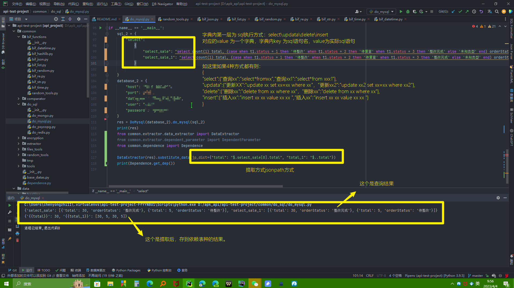

#### setup setupclass teardown tearDownClass ?

其实这套代码这些都可以不需要使用，也可以使用，定制一些初始化函数或者唯一登录这样用，做数据清晰操作？可以将sql写excel，
或者单独再excel种建立一个sheet来执行sql也是可行的，方法很多，很灵活

#### postman或者swagger的文件怎么快速转为测试用例？
本框架已经封装好了解析函数，直接将postman文件导出，放到指定目录
运行excel_converter.py文件，即可得到测试用例
非常快捷省事，不用一条一条复制粘贴
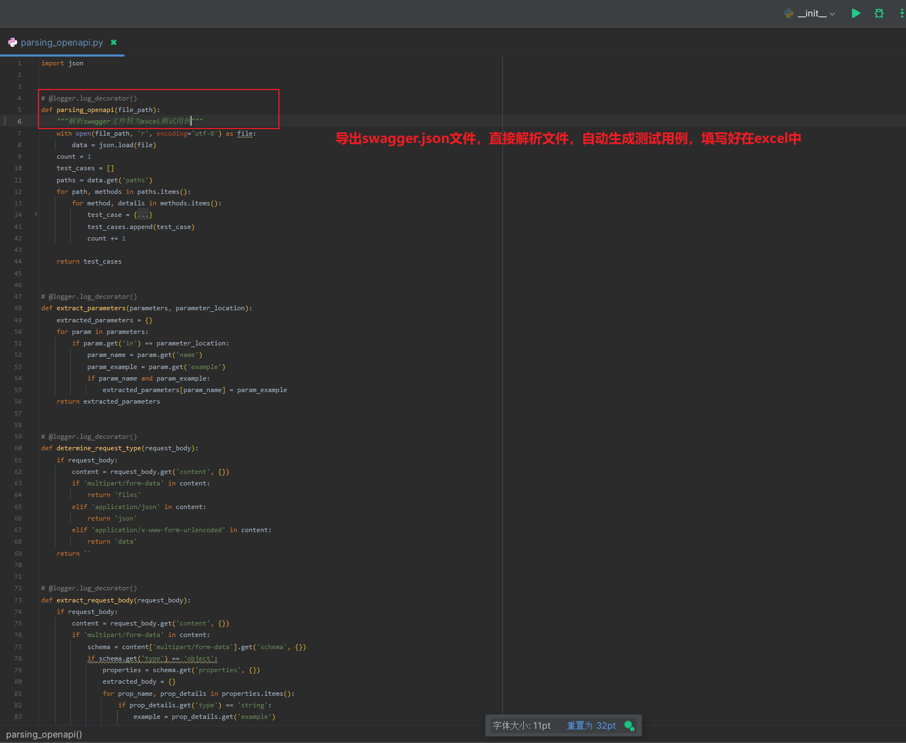
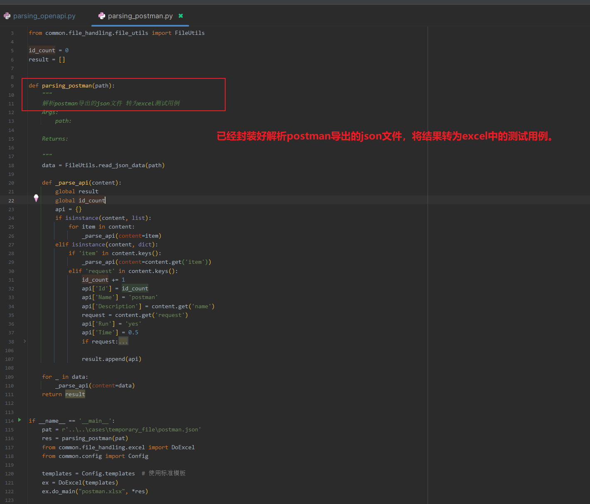
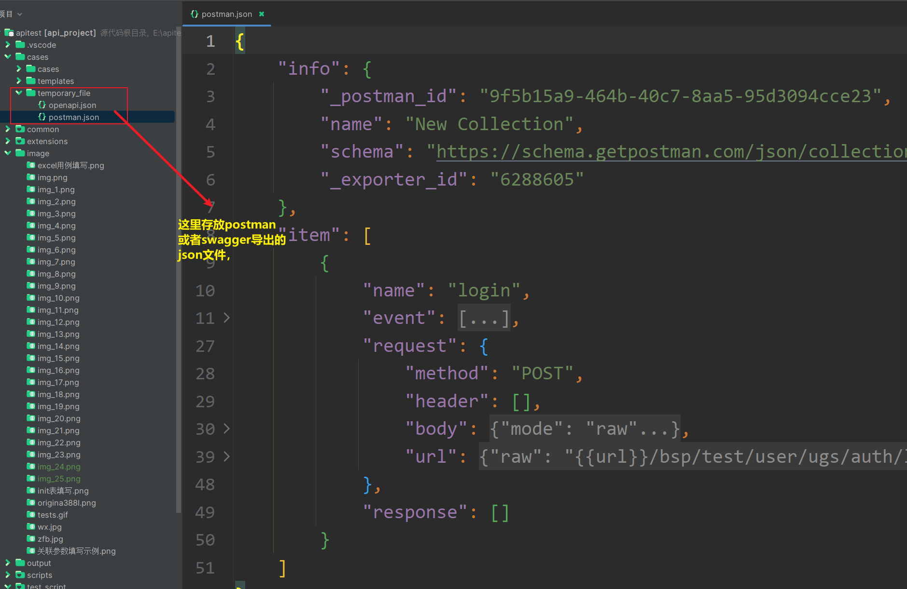

#### 更换不同的数据库？

目前内置有多种数据库查链接方式，但是尚未使用起来，只是将mysql使用起来了，使用者如需要使用其他如 mongoDB 这类数据库，
可以按 mysql 设计的方式去扩展这个数据库以适应 excel测试用例编写方式，也可以联系作者处理


#### 发送企业微信通知

可以根据需要，自由修改企业微信发送的模板等等信息


#### 主函数执行入口


#### 日志打印装饰器


#### 基本数据


#### 测试报告?

html 或者 excel 中 都有，直接自行使用查看吧
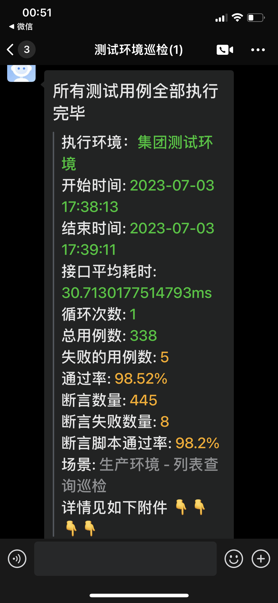
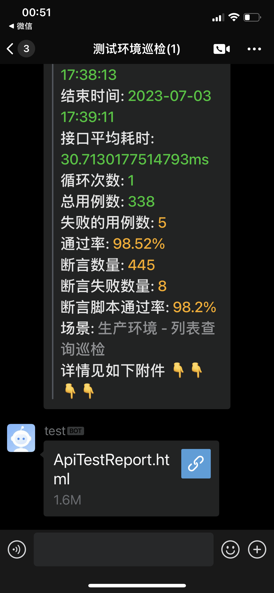


#### 统计用例运行时长？

统计了每条用例从请求发出到响应的时长，没有统计其他时常信息，具体可以从 html 中查看

#### 其他

- 本框架为2.0升级版本，升级之后的功能，现在基本上都是在 excel 中维护用例，无需测试人员编写代码，
- 和 1.0版本的区别在于，1.0版本也不需要测试人员写代码，但是断言的方式比较生硬。
- 1.0版本已经集成到测试开发平台，可以去平台使用，具体gitee
  地址：[https://gitee.com/chenyongzhiaaron/ApiTestPlatform.git](https://gitee.com/chenyongzhiaaron/ApiTestPlatform.git)

### 独立个人信息工具介绍

直接执行 `main_personal_information.py` 文件就可以生成非常棒的测试数据
Python随机生成个人信息, 包括姓名、性别、年龄、出生日期、身份证号、银行卡号、电话、手机号、邮箱等信息。

生成随机个人信息

```
PS D:\api-test-project> python .\main_personal_information.py                                                                                                                                                                                                 海省广州市南
请输入你需要生成的数据总数:10
+--------+------+------+------------+--------------------+----------------------+--------------+-------------+-------------------------+----------------------------------------+--------------------+                                                        门特别行政区
| 用户名 | 性别 | 年龄 |    生日    |       身份证       |    银行卡或信用卡    |     座机     |    手机号   |           邮箱          |                  地址                  |  统一社会信用代码  |
+--------+------+------+------------+--------------------+----------------------+--------------+-------------+-------------------------+----------------------------------------+--------------------+                                                        西省张家港市
|  刘世  |  男  |  57  | 1965-07-21 | 342422196507219413 |  62263745016607204   | 0744-3715089 | 14705083324 |     liushi@tianya.cn    |    甘肃省辽阳县沙湾海口街y座 180548    | 713101514054645086 |
| 龙清承 |  男  |  56  | 1966-08-21 | 342400196608212132 | 62284150185529051643 | 0893-4423648 | 13487550352 | longqingcheng@tianya.cn |    辽宁省玉珍市黄浦重庆街z座 401247    | 93421303115117882W |
|  刘娴  |  女  |  37  | 1985-05-23 | 411023198505239964 | 6213058212589619696  | 0562-0004972 | 17303409666 |    liuxian@tianya.cn    |     福建省拉萨县朝阳胡街X座 479131     | 92341122605351081N |
|  朱晨  |  男  |  55  | 1967-10-08 | 142733196710082991 |  45128971703439970   | 0375-7394954 | 18024463495 |     zhuchen@139.com     | 宁夏回族自治区秀云县高坪任路Q座 544781 | 955205231604137955 |
| 许天有 |  男  |  51  | 1971-10-17 | 330901197110176212 |  62592648755593670   | 0973-8733227 | 13413236004 |     xutianyou@wo.cn     |    辽宁省天津市南长深圳路f座 952461    | 91120114649961877C |
|  陈锦  |  女  |  29  | 1993-02-12 | 452123199302128568 |  62260020819291645   | 0915-7410180 | 17509030433 |    chenjin@icloud.com   |    重庆市西安市沙湾广州街G座 531384    | 92445302298701343Q |
+--------+------+------+------------+--------------------+----------------------+--------------+-------------+-------------------------+----------------------------------------+--------------------+
```

## 赞赏

如果这个库有帮助到你并且你很想支持库的后续开发和维护，那么你可以扫描下方二维码随意打赏我，我将不胜感激


