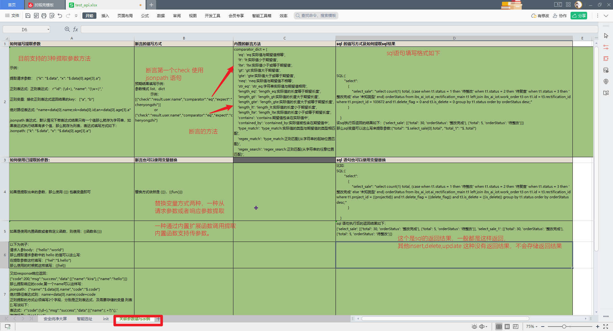

# 使用文档

#### 项目介绍

接口自动化测试项目1.0

#### 软件架构

本框架主要是基于 Python + unittest + ddt + HTMLTestRunner + log + excel + mysql + 企业微信通知 + Jenkins 实现的接口自动化框架。

##### 想要`2.0`版本尚未开源的小伙伴，可以私聊勇哥哈。

* 项目参与者: 陈勇志
* 技术支持邮箱: 262667641@qq.com
* 个人微信: blue-blue-lemon
* 个人博客地址:  [https://home.cnblogs.com/u/Nephalem-262667641](https://home.cnblogs.com/u/Nephalem-262667641)

## 前言

公司突然要求你做自动化，但是没有代码基础不知道怎么做？或者有自动化基础，但是不知道如何系统性的做自动化，
放在 excel 文件中维护，不知道如何处理多业务依赖的逻辑？

那么本自动化框架，将为你解决这些问题。
框架主要使用 python 语言编写，结合 unittest 进行二次开发，用户仅需要在 excel 文件中编写测试用例，
编写成功之后，会自动生成测试用例的代码，零基础代码小白，也可以操作。

本框架支持多环境切换，多业务接口依赖，mysql 数据库断言和 接口响应断言，并且用例直接在 excel 文件中维护，无需编写业务代码，
本框架支持动态脚本函数扩展，可以随时内部预置函数，或者增加动态脚本，通过固定格式写法 {{fun()}} 动态调用
接口 unittest 框架生成 HTML 报告及 excel 用例执行报告，并且发送 企业微信通知/ 钉钉通知/ 邮箱通知/ 飞书通知，灵活配置。

## 实现功能

* 测试数据隔离, 实现数据驱动
* 直接多套环境使用，比如测试用例相同，但是环境不同，只需在 excel 中启用需要执行的环境即可
* 支持多接口数据依赖: 如A接口需要同时依赖 B、C 接口的响应数据作为参数,或者 c 接口断言需要动态使用A接口的入参作为预期结果
* 数据库断言: 直接在测试用例中写入查询的 sql 即可断言，无需编写代码
* 动态多断言: 如接口需要同时校验响应数据和 sql 校验，支持多场景断言
* 自动生成用例代码: 测试人员在 excel 文件中填写好测试用例, 程序可以直接生成用例代码，纯小白也能使用
* 统计接口的运行时长: 拓展功能，订制开关，可以决定是否需要使用
* 日志模块: 打印每个接口的日志信息，同样订制了开关，可以决定是否需要打印日志
* 钉钉、企业微信通知: 支持多种通知场景，执行成功之后，可选择发送钉钉、或者企业微信、邮箱通知
* 内置实现了一部分随意函数及自定义常用函数：如:随机字符串、任意日期时间、随机gps、随机用户身份证、地址、邮箱、企业信息等等
* 自定义拓展函数: 如用例中需要自己实习一些函数使用，可以随时写上函数，通过 {{func()}} 随时调用
* 支持自定义脚本代码段，类似postman一样给每一条测试用例编写一些代码，使用PM对象操作前后置数据
* 支持导入postman或者openapi导出的json文件自动处理成测试用例，然后修改一下参数即可使用

## 遇到问题

* 请仔细阅读文档，文档中几乎可以帮你避免所有的问题
* 可以添加微信： blue-blue-lemon, 添加微信会将你拉倒自动化交流群中，群内有很多热心的小伙伴，但是前提是希望你已经阅读了文档中的所有内容
* 你也可以请作者为你解答，当然在我时间空闲的时候，也可以让作者为你一对一服务，当然是收费的。

## 目录结构
```markdown
.
├── OutPut
│   ├── Log                                     // 日志
│   ├── Reports                                 // html|json 报告
│   │   ├── T 测试报告.html
│   │   ├── T.html
│   │   ├── history.json
│   │   ├── report.html
│   │   ├── test_api 测试报告.html
│   │   └── test_api.html
│   └── __init__.py
├── Pipfile
├── Pipfile.lock
├── README.md                                   // 帮助
├── cases                                       // 测试用例数据文件夹
│   ├── cases                                   // 测试用例
│   │   ├── test_api.xlsx                       
│   │   ├── test_openapi_cases.xlsx
│   │   └── test_postman_cases.xlsx
│   ├── templates                               // 测试用例模板
│   │   └── template.xlsx
│   └── temporary_file                          // openapi| postman 导出的 json文件存放位置
│       ├── apifox.json
│       ├── openapi.json
│       └── postman.json
├── common                                      // 功能配置及核心功能函数
│   ├── __init__.py
│   ├── bif_functions                           // 内置一些函数工具
│   │   ├── __init__.py
│   │   ├── bif_datetime.py                     // 内置日期时间函数
│   │   ├── bif_hashlib.py                      // 内置hash 函数
│   │   ├── bif_json.py                         // 内置json解析函数
│   │   ├── bif_list.py                         // 内置列表操作函数
│   │   ├── bif_random.py                       // 内置随机函数
│   │   ├── bif_re.py                           // 内置正则函数
│   │   ├── bif_str.py                          // 内置字符串函数
│   │   ├── bif_time.py                         // 内置时间函数
│   │   └── random_tools.py                     // 内置其他随机函数
│   ├── config.py                               // 公共基础环境路径存放位置：如日志，测试测试脚本路径
│   ├── crypto                                  // 加密工具
│   │   ├── __init__.py
│   │   ├── encryption_aes.py                   // aes 加密
│   │   ├── encryption_base64_to_image.py       // base64 转图片工具
│   │   ├── encryption_main.py                  // 执行加入函数入口，对应excel中的加密方法选项，结合 extensions 中的 sign 可自定义加密规则
│   │   ├── encryption_rsa.py                   // 常用的字符串加密工具函数
│   │   └── encryption_str.py                   // rsa 加密
│   ├── data_extraction                         // 数据提取器
│   │   ├── __init__.py 
│   │   ├── analysis_json.py                    // json 字典分析函数，类似 jsonpath
│   │   ├── assert_dict.py                      // 旧断言字段函数 （暂时舍弃）
│   │   ├── data_extractor.py                   // 数据提取函数
│   │   ├── dependent_parameter.py              // 数据替换函数
│   │   └── dict_get.py                         // 旧路径提取函数
│   ├── database                            // 数据库操作工具
│   │   ├── __init__.py
│   │   ├── do_mongo.py                     // mongoDB 操作工具
│   │   ├── execute_sql.py                     // mysql 操作工具
│   │   ├── do_psycopg.py                   // presto 操作工具
│   │   └── do_redis.py                     // redis 操作工具
│   ├── variables.py                       // 数据依赖类
│   ├── file_handling                       // 文件操作
│   │   ├── __init__.py
│   │   ├── do_bat_sql.py                   // 批量读取文件下的 sql 文件并打开文件执行文件内的每条 sql 
│   │   ├── do_excel.py                     // excel 处理
│   │   ├── excel.py                        // excel 处理(旧)
│   │   ├── get_all_path.py                 // 递归获取目录下所有的文件的路径
│   │   ├── get_conf_data.py                // 读取配置文件(不使用，更改为 pytest 模式时，可能 pytest 需要)
│   │   ├── get_excel_init.py               // 读取 excel 中初始化 init 表 的数据   
│   │   ├── get_file.py                     // 获取指定目录内的所有文件(没卵用)
│   │   ├── get_folder.py                   // 获取指定路径下的所有文件夹及文件（没卵用）
│   │   └── read_file.py                    // 文件读取（没卵用）
│   ├── random_tools                        // 独立的随机工具类，主要用于自动创建一些测试数据给收工测试使用
│   │   ├── __init__.py
│   │   ├── credit_cards                    // 随机银行卡
│   │   │   ├── __init__.py
│   │   │   ├── bankcard.py
│   │   │   └── cardbin.csv
│   │   ├── credit_identifiers              // 随机企业唯一信用代码   
│   │   │   ├── __init__.py
│   │   │   ├── address.json
│   │   │   ├── credit_identifier.py
│   │   │   └── unified_social_credit_identifier.py
│   │   ├── emails                          // 速记邮件
│   │   │   ├── __init__.py
│   │   │   ├── email.py
│   │   │   └── free_email.csv
│   │   ├── identification                  // 随机身份证
│   │   │   ├── __init__.py
│   │   │   ├── area.csv
│   │   │   └── id_card.py
│   │   ├── names                           // 随机中国人姓名
│   │   │   ├── __init__.py
│   │   │   ├── first_name_boy.csv
│   │   │   ├── first_name_girl.csv
│   │   │   ├── last_name.csv
│   │   │   └── name.py
│   │   └── phone_numbers                   // 随机手机号
│   │       ├── __init__.py
│   │       ├── phone.py
│   │       └── phone_area.csv
│   ├── utils                               // 杂七杂八的工具包
│   │   ├── WxworkSms.py                    // 企业微信，需要使用其他工具，可以在这个模块下扩展增加脚本
│   │   ├── __init__.py
│   │   ├── captcha.py                      // 识别图片转字符串，常用于验证码登录
│   │   ├── function_run_time.py            // 运行时间装饰器（没卵用）
│   │   ├── hooks.py                        // 请求钩子函数（暂时没用到）
│   │   ├── http_client.py                  // http请求封装
│   │   ├── logger.py                       // 日志记录loggin
│   │   ├── mylogger.py                     // 日志记录loguru
│   │   ├── parsing_openapi.py              // 解析 openapi导出的文件 json-->excel
│   │   ├── parsing_postman.py              // 解析 postman导出的文件 json-->excel
│   │   ├── request.py                      // 请求封装(暂时没用到)
│   │   ├── request_processor.py            // 请求处理器（暂时没用到）
│   │   ├── retry.py                        // 重试（实际没啥用）
│   │   └── singleton.py                    // 单例模式
│   └── validation                          // 断言及加载动条函数工具包
│       ├── __init__.py
│       ├── comparator_dict.py              // 自定义比较器名词释义
│       ├── comparators.py                  // 自定义比较器
│       ├── extractor.py                    // 提取器
│       ├── load_modules_from_folder.py     // 动态从模块中加载函数（暂未使用）
│       ├── loaders.py                      // 动态加载函数及加载内置比较器等工具包
│       └── validator.py                    // 断言校验器
├── debug                                   // 调试使用，与实际程序没啥关系
├── excel_converter.py                      // postman|openapi 导出的json文件转excel测试用例的程序入口
├── extensions                              // 动态扩展程序文件包
│   ├── __init__.py
│   ├── ext_method_online.py                // 动态扩展方法
│   └── sign.py                             // 自定义签名规则
├── generate_tree.py                        // 目录树生成文件
├── image                                   // 图片
│   ├── wx.jpg
│   └── zfb.jpg
├── main.py                                 // 自动化测试执行入口文件
├── main_personal_information.py            // 随机个人信息
├── pipenv_command.text
├── scripts                                 // 动态测试用例脚本库
│   └── __init__.py
├── temp                                    // 临时脚本文件，与自动化测试无关
│   ├── __init__.py
│   ├── excel_handler.py
│   ├── extent
│   │   ├── __init__.py
│   │   ├── api.py
│   │   ├── config.py
│   │   └── test_api_script.py
│   ├── fun.md
│   ├── get_zl.py
│   ├── mqtt_sender.py
│   ├── parsing_jmeter.py
│   ├── rabbit_mq_sender.py
│   └── test_log.py
└── test_script                             // 执行测试逻辑脚本文件
    ├── __init__.py
    ├── automation
    │   ├── __init__.py
    │   └── test_api_script.py              // 测试执行文件
    └── script                              // 重新封装的测试脚本框架
        ├── __init__.py
        ├── baseclass.py
        └── test_api.py

```

## 依赖库

参考 pipenv --Pipfile 虚拟环境文件，不一一列出
## 安装教程

首先，执行本框架之后，需要搭建好 python 环境，python 环境搭建自行百度

1. 安装 pipenv环境： pip install pipenv
2. 创建虚拟环境： pipenv install
3. 如果有个别包无法安装,则：pipenv shell 进入环境后，再pipenv install XX包

#### 使用说明

1. 提取参数方式可以使用正则，jsonpath及json逐层取值
2. xxxx
3. Personalinformation

## 开放测试接口文档

大家可以使用开源接口中的登录、个人信息、收藏（新增、查看、修改、删除）等功能，编写接口自动化案例，然后测试程序脚本
下方是接口文档地址，大家可以自行查看（因为开源的接口，里面有些逻辑性的功能，如修改被删除的网址接口并没有过多的做判断，
因此用例中只写了一些基础的场景，仅供大家参考。）

- [https://wanandroid.com/blog/show/2](https://wanandroid.com/blog/show/2)

## 如何创建用例

### 创建用例步骤

1. 在 data 文件夹下方创建被测模块或者系统，然后在系统下创建相关的 excel 用例
2. 将测试用例路径添加到 common 文件夹下的 base_datas.py 文件中
3. 进入 test_script/auto_script 文件夹，在该文件夹下操作 test_standard.py 文件将 test_file 变量地址替换为刚刚太难写的测试用例地址
4. 将login.py 文件的登录改为当前被测系统的初始登录，如果改文件不写登录，那么需要在 test_standard.py
   文件中将登录去除，并将初始header改修改为{}
5. excel 中的用例必须填写用例id,初始化 init sheet 中的部分字段必须填写
6. 以上都填写完成，记得先关闭 excel ，然后就可以单独执行 test_standard.py 文件，或者直接运行 test_main.py 主入口文件，生成HTML报告

下面我们来看一下，如何创建用例

### 用例中相关字段的介绍

- 下发截图为 init 初始化基础数据填写用例
  
- init 中 sheets 内的列表排序是有作用的，执行用例是按照列表内值排序执行的。
- 下方截图就是 excel 用例 每个字段是否必填的描述
  
- 每条测试用例都可以自定义是否开启，开启则执行，不开启则跳过，默认执行结果是通过
- 每一个sheet都可以随意组合用例，不同sheet之间的变量参数可以公用，不独立设计，主要是考虑到分sheet只是为了方面管理用例，但是执行依然是一次性全部执行
- 目前没有设计每一个sheet的最大用例条数，默认取excel最大数据量，如果发现最大数据量撑爆内存，建议分多个excel来写测试用例
- 目前使用的生成器的方式读取excel，主要是防止一次性内存被撑爆
- 测试报告是按照excel来生成的，测试报告的样式没有按模块区分，实际上直接打开excel就可以看到报告结果了。
- 其他一些没有多大作用的，通过率，跳过条数，通过条数，失败条数等，没有另外处理，全部由html的报告自动处理
- 下方截图为关联参数填写示例
  

### 常用的一些内置函数

所有的内置函数都在 common/bif_functions 这个包内，用户可以自定义添加内置函数，设计内置函数一定要设计返回值，不能直接返回
None，貌似没有对 None 特殊处理
以下是一些内置函数讲解


- 这个MD5方法，一般都没有使用，一般都是直接excel中是否使用【参数加密方式字段开关】来处理加密
  
- 内置函数使用，统一是 {{xxx()}}，可以传参数到()内
  
- 获取一些时间戳方法，可以带参数
  
- Faker 库里面的有些随机数，需要更多自己添加就行了。

### 用例中添加等待时间

excel 字段中一个 method，字段值设置为 time 即可，URL 下填写需要等待的时间，单位S


### 用例在执行前，需要单独执行 sql 或者执行后需要单独执行 sql,或者请求后立刻执行 sql 并断言 sql

excel 中有一个 method 字段，设置值为 sql 即可，后面的 SQL,SQL 变量字段按需填写即可，一定要符合规范填写
或者在请求的后面填写 sql 语句及 sql 变量，都会默认先执行 sql，再执行请求。


### setup setupclass teardown tearDownClass ?

其实这套代码这些都可以不需要使用，也可以使用，定制一些初始化函数或者唯一登录这样用，做数据清晰操作？可以将sql写excel，
或者单独再excel种建立一个sheet来执行sql也是可行的，方法很多，很灵活

### 更换不同的数据库？

目前内置有多种数据库查链接方式，但是尚未使用起来，只是将mysql使用起来了，使用者如需要使用其他如 mongoDB 这类数据库，
可以按 mysql 设计的方式去扩展这个数据库以适应 excel测试用例编写方式，也可以联系作者处理


### 发送企业微信通知

可以根据需要，自由修改企业微信发送的模板等等信息


### 主函数执行入口


### 日志打印装饰器


### 基本数据


### 测试报告?

html 或者 excel 中 都有，直接自行使用查看吧


### 统计用例运行时长？

统计了每条用例从请求发出到响应的时长，没有统计其他时常信息，具体可以从 html 中查看

### 其他

- 本框架为2.0升级版本，升级之后的功能，现在基本上都是在 excel 中维护用例，无需测试人员编写代码，
- 和 1.0版本的区别在于，1.0版本也不需要测试人员写代码，但是断言的方式比较生硬。
- 1.0版本已经集成到测试开发平台，可以去平台使用，具体gitee
  地址：[https://gitee.com/chenyongzhiaaron/ApiTestPlatform.git](https://gitee.com/chenyongzhiaaron/ApiTestPlatform.git)

## 独立个人信息工具介绍

Python随机生成个人信息, 包括姓名、性别、年龄、出生日期、身份证号、银行卡号、电话、手机号、邮箱等信息。

生成随机个人信息

```
PS D:\api-test-project> python .\main_personal_information.py                                                                                                                                                                                                 海省广州市南
请输入你需要生成的数据总数:10
+--------+------+------+------------+--------------------+----------------------+--------------+-------------+-------------------------+----------------------------------------+--------------------+                                                        门特别行政区
| 用户名 | 性别 | 年龄 |    生日    |       身份证       |    银行卡或信用卡    |     座机     |    手机号   |           邮箱          |                  地址                  |  统一社会信用代码  |
+--------+------+------+------------+--------------------+----------------------+--------------+-------------+-------------------------+----------------------------------------+--------------------+                                                        西省张家港市
|  刘世  |  男  |  57  | 1965-07-21 | 342422196507219413 |  62263745016607204   | 0744-3715089 | 14705083324 |     liushi@tianya.cn    |    甘肃省辽阳县沙湾海口街y座 180548    | 713101514054645086 |
| 龙清承 |  男  |  56  | 1966-08-21 | 342400196608212132 | 62284150185529051643 | 0893-4423648 | 13487550352 | longqingcheng@tianya.cn |    辽宁省玉珍市黄浦重庆街z座 401247    | 93421303115117882W |
|  刘娴  |  女  |  37  | 1985-05-23 | 411023198505239964 | 6213058212589619696  | 0562-0004972 | 17303409666 |    liuxian@tianya.cn    |     福建省拉萨县朝阳胡街X座 479131     | 92341122605351081N |
|  朱晨  |  男  |  55  | 1967-10-08 | 142733196710082991 |  45128971703439970   | 0375-7394954 | 18024463495 |     zhuchen@139.com     | 宁夏回族自治区秀云县高坪任路Q座 544781 | 955205231604137955 |
| 许天有 |  男  |  51  | 1971-10-17 | 330901197110176212 |  62592648755593670   | 0973-8733227 | 13413236004 |     xutianyou@wo.cn     |    辽宁省天津市南长深圳路f座 952461    | 91120114649961877C |
|  陈锦  |  女  |  29  | 1993-02-12 | 452123199302128568 |  62260020819291645   | 0915-7410180 | 17509030433 |    chenjin@icloud.com   |    重庆市西安市沙湾广州街G座 531384    | 92445302298701343Q |
+--------+------+------+------------+--------------------+----------------------+--------------+-------------+-------------------------+----------------------------------------+--------------------+
```
## 赞赏

如果这个库有帮助到你并且你很想支持库的后续开发和维护，那么你可以扫描下方二维码随意打赏我，我将不胜感激


